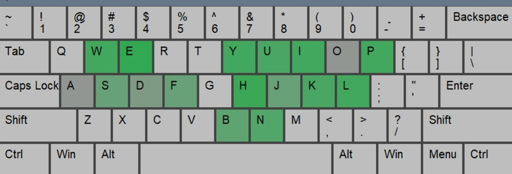

# Keyboard Tracker script

A simple Python script that executes in the background and keep tracks of which keys you press on your keyboard. When the tracking is finished, you'll see a nice keyboard display with a color gradient on the keys
you pressed.

|               Showcase                |                  
|:-------------------------------------:|
|              | 


## Motivation

When I'm coding, sometimes I feel really focused, and then I notice about the amount of times I press keys on my keyboard. It's a really nice feeling, specially when using a good mechanic keyboard :).

That motivated me to create this simple script, so I am aware of which keys do I use the most, and how many keys I press at the end of my workday. I wanted something simple that doesn't consume lot of resources and that can run in the background all the time. So here it is!

## Requirements

- Python v3.12.7+
- Windows 10/11

## How to install

Create a new virtual environment and install the packages in requirements.txt:

```commandline
> python -m venv .venv
> .venv\Scripts\activate
> python -m pip install -r requirements.txt
```

## How to use

- Execute the Python file to start the tracking. The script runs in the background, so even when the script is not focused, it will still track the keys you press.
- When you want the tracking to be finished, you just need to click 5 times in a row the escape (`ESC`) key. This will trigger the end of the execution.
- Just after finishing the tracking, a window will pop up showing a keyboard with a color gradient over the keys you have been using.
- You can also find some interesting information in the command line where you ran the script: total count of keys pressed, as well as count for each key separately.

## Future improvements

[ ] Create a .bat (and bash) file so I can easily execute the script.
[ ] Add the .bat executable to startup apps so everytime I start working, the tracking starts automatically.
[ ] Test on Linux
[ ] Add graphics to display the info that I am currently showing on the command line, to make it prettier. 